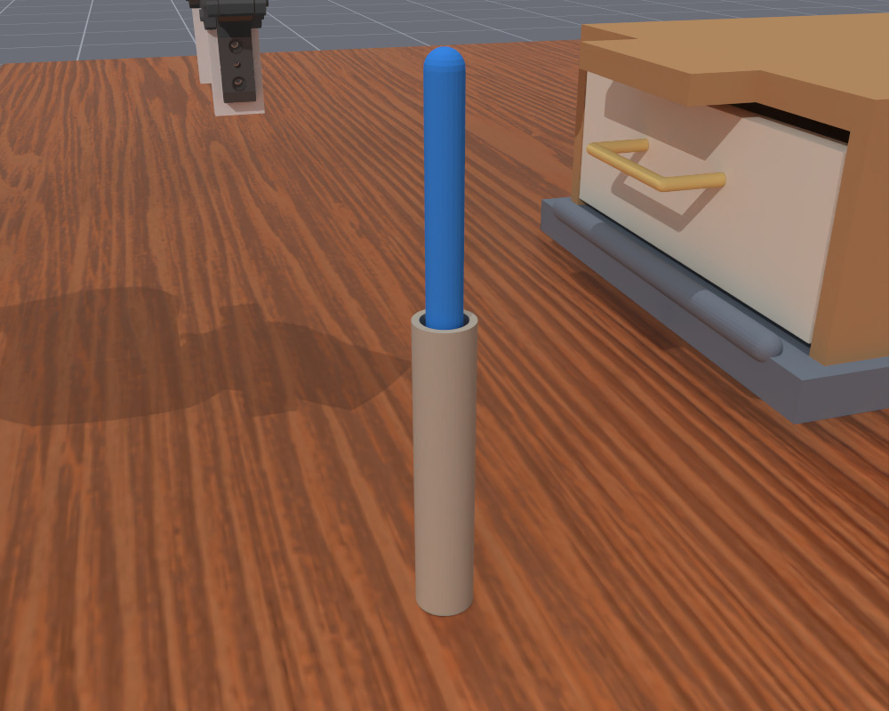
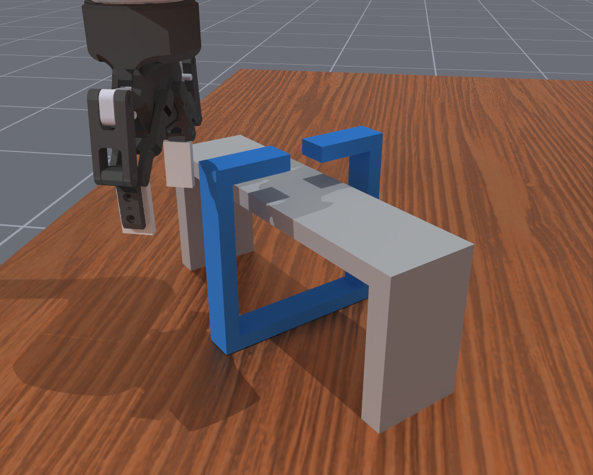
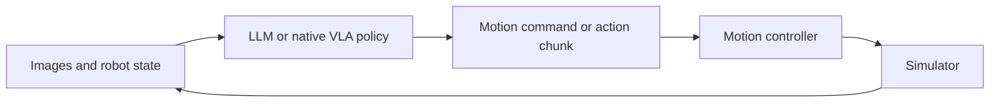

# Agentic Framework and Ditto Bench


Inspired by [Inspect Robots](https://github.com/robocurve/inspect-robots), this framework simplifies the robot control loop for research analysis and adds detailed trajectory recording. The agentic framework is primarily adapted for OpenAI-family models such as Astra through OpenAI Responses; compatibility with other models is not guaranteed.

This repository contains **Ditto Bench**, an **agentic robot-control framework**, and native **pi05** and **MolmoAct2** baselines. Supported environments are **Ditto Bench**, **LIBERO**, and the official **MolmoAct2-ManiSkill** box task.

## Ditto Bench

Ditto Bench evaluates physical interaction: goals are straightforward to describe, while success requires handling contact, geometric constraints, precise motion or tool use. It contains six tasks, each with `easy`, `medium`, `hard` and `xhard` variants, for 24 task–difficulty combinations. The benchmark uses ManiSkill 3 / SAPIEN and MolmoAct2's DROID simulation setup with a Franka FR3 arm and Robotiq 2F-85 gripper.


| ID  | Task                   | Illustration                                                                                               | Goal                                                             | Core challenge                                                                          |
| --- | ---------------------- | ---------------------------------------------------------------------------------------------------------- | ---------------------------------------------------------------- | --------------------------------------------------------------------------------------- |
| 0   | Constrained extraction |                 | Pull the blue board completely out of the slot.                  | Align motion with a narrow channel while managing contact.                              |
| 1   | Odd-object grasping    |                      | Pick up the blue object and put it in the basket.                | Choose grasps across changes in shape and contact properties.                           |
| 2   | Precision insertion    |        | Insert the yellow object fully into the matching slot.           | Match shape and orientation under tight clearances.                                     |
| 3   | Standing stability     |  | Stand the object upright, gray base down, without robot contact. | Reorient and balance the object through controlled release.                             |
| 4   | Tool-assisted drawer   |              | Use the blue tool to open the drawer.                            | Engage the tool and transmit force through contact despite resistance and obstructions. |
| 5   | Ring release           |                 | Take the blue open ring off the fixed bridge.                    | Coordinate translation and rotation through a constrained opening.                      |


Evaluation records task success and a continuous progress score. See [task definitions](ditto-bench/docs/TASKS.md) for difficulty designs and scoring, and the [benchmark README](ditto-bench/README.md) for preview and direct Gym examples.

## Agentic framework

The framework runs an observation–decision–motion loop. An LLM receives current images and public robot state, together with configurable interaction history and optional demonstrations, then issues a motion command. The controller executes the configured steps before the next observation and decision. Native pi05 and MolmoAct2 policies use their own action adapters within the same evaluation and recording pipeline.




JSON configurations select tasks, models, reasoning effort, history, demonstrations, motion interfaces, H/K schedules, step budgets and recording. Saved trajectories connect model requests and decisions to executed actions, observations and task outcomes. The framework supports DROID and LIBERO profiles for both native model families; simulator workers and model servers run in separate environments. See [architecture](docs/ARCHITECTURE.md) for component boundaries and [usage](docs/USAGE.md) for configuration and output conventions.

## Repository structure and reading guide

```text
agentic-framework/       Policies, controllers, adapters, simulator workers and recording
ditto-bench/             Task physics, procedural geometry and success/progress scoring
examples/                Offline loop and focused agent, native VLA and preview configs
configs/experiments/     Configurations for the research experiment conditions
scripts/                 Setup, evaluation and native model serving entry points
tools/                   Result summaries
docs/                    Installation, usage, architecture and task illustrations
credentials.env.example  Blank credential template
```

Setup and evaluation populate project-local `envs/`, `third_party/`, `models/`, `data/`, `cache/`, `.config/` and `outputs/` directories. These resources and your `credentials.env` are ignored by Git.


| To understand or change…                | Start here                                                                                                                                                                                                                                |
| --------------------------------------- | ----------------------------------------------------------------------------------------------------------------------------------------------------------------------------------------------------------------------------------------- |
| Running the code                        | Follow [Quick start](#quick-start), then [installation](docs/INSTALLATION.md) and [usage](docs/USAGE.md).                                                                                                                                 |
| Experiment settings                     | Start from [examples](examples), then inspect [experiment configs](configs/experiments). [scripts/eval.py](scripts/eval.py) resolves and launches a config.                                                                               |
| LLM decisions and motion execution      | Read [harness/run.py](agentic-framework/src/agentic_framework/harness/run.py), [policy.py](agentic-framework/src/agentic_framework/harness/policy.py) and [controller.py](agentic-framework/src/agentic_framework/harness/controller.py). |
| Native VLA inference and action mapping | Read [models/vla](agentic-framework/src/agentic_framework/models/vla), [native_controller.py](agentic-framework/src/agentic_framework/harness/native_controller.py) and the [model profiles](agentic-framework/configs/models).           |
| Benchmark tasks and scoring             | Read [task definitions](ditto-bench/docs/TASKS.md), the [catalog](ditto-bench/src/ditto/catalog.py), [task implementations](ditto-bench/src/ditto/tasks) and [framework integration](ditto-bench/src/ditto/integration).                  |
| Recorded results                        | Read the output conventions in [usage](docs/USAGE.md#processes-outputs-and-metrics), then use [tools/summarize.py](tools/summarize.py) to aggregate runs.                                                                                 |


## Quick start

### Environment

Requires Linux and Python 3.11. Install [uv](https://docs.astral.sh/uv/) first, then run:

```bash
cd /path/to/project
bash scripts/setup.sh
envs/agentic-framework/bin/python -B examples/offline.py
```

The offline example runs two scripted decisions through the real policy and motion controller. It requires no GPU, simulator or API key and makes no model calls.

### API Key

Create a personal project key in [OpenAI Platform](https://platform.openai.com/api-keys), following the [official API quickstart](https://developers.openai.com/api/docs/quickstart). Fill `OPENAI_API_KEY` in the root `credentials.env`, keep `OPENAI_BASE_URL=https://api.openai.com/v1`, and run `chmod 600 credentials.env`. Setup creates this file from the tracked [credentials.env.example](credentials.env.example) only if it is absent; preserve other entries if your local credentials file already exists.

LLM configs select this local file through `llm.env_file`.

### Run a configuration

Edit the JSON's research settings: model, reasoning effort, history, motion interface and H/K, tasks, seeds, budgets, recording and output path. Agent, native VLA and preview configs contain the settings relevant to that mode. Runtime details use framework defaults unless a condition needs an override.

After [simulator installation](docs/INSTALLATION.md), activate the framework environment and select a GPU:

```bash
source envs/agentic-framework/bin/activate
python3 scripts/eval.py examples/agent.json --dry-run
CUDA_VISIBLE_DEVICES=0 python3 scripts/eval.py examples/preview.json
CUDA_VISIBLE_DEVICES=0 python3 scripts/eval.py examples/agent.json
CUDA_VISIBLE_DEVICES=0 python3 scripts/eval.py examples/molmoact2.json
```

Experiment conditions are ordinary JSON files under [configs/experiments](configs/experiments); launch each with `python3 scripts/eval.py CONFIG.json`. See [usage](docs/USAGE.md), [installation](docs/INSTALLATION.md) and [architecture](docs/ARCHITECTURE.md).

Original project code is licensed under the [MIT License](LICENSE). Bundled third-party code and separately downloaded resources retain their own licenses; see [third-party notices](THIRD_PARTY_NOTICES.md).