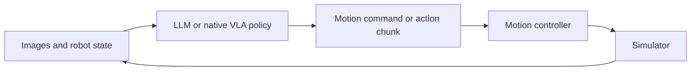

# LLM-agent for Robot Control


This repository provides a simple **agentic framework for LLM robot control** and **Ditto Bench**, a benchmark for studying motion and control through physically demanding manipulation tasks. It supports LLM policies and native **pi05** and **MolmoAct2** baselines on Ditto Bench, LIBERO and the official MolmoAct2-ManiSkill box task.

The framework draws on [Inspect Robots](https://github.com/robocurve/inspect-robots), simplified for research and trajectory analysis. Its LLM integration primarily targets OpenAI-family models such as Astra; compatibility with other models is not guaranteed.

## What is included

### Ditto Bench

Six tasks, each with `easy`, `medium`, `hard` and `xhard` variants, test contact, geometry, precision and tool use. They run in ManiSkill 3 / SAPIEN with the Franka FR3 and Robotiq 2F-85 gripper from MolmoAct2's DROID setup.


| ID  | Task                   | Illustration                                                                                               | Goal                                                    |
| --- | ---------------------- | ---------------------------------------------------------------------------------------------------------- | ------------------------------------------------------- |
| 0   | Constrained extraction |                 | Pull the board out of the slot.                         |
| 1   | Odd-object grasping    |                      | Put the object in the basket.                           |
| 2   | Precision insertion    |        | Insert the object fully into its matching slot.         |
| 3   | Standing stability     |  | Stand the object gray base down, without robot contact. |
| 4   | Tool-assisted drawer   |              | Open the drawer using the tool.                         |
| 5   | Ring release           |                 | Remove the open ring from the bridge.                   |


[Task definitions](ditto-bench/docs/TASKS.md) · [Gym API](ditto-bench/README.md#direct-gym-example)

Each task provides a language instruction, camera observations, a task-specific success check and continuous progress. Difficulty changes the physical problem, such as clearance, object geometry or tool access. Seeded layouts support comparisons across policies.

### Agentic framework

The framework runs a shared observation–decision–execution loop for LLM agents and native vision-language-action (VLA) policies:

- **LLM control:** the model receives camera images and robot state, then issues a relative motion target or a motion chunk. The controller executes it for a configurable number of control steps before the next decision.
- **Context and demonstrations:** configure reasoning effort, interaction history and a recorded teacher trajectory. Teachers can be LLM or native VLA policies; demonstration content determines what the student receives.
- **Native baselines:** pi05 and MolmoAct2 adapters preserve each checkpoint's observation and action conventions. The launcher manages local model servers and simulator workers.
- **Rollout records:** save model requests and responses, actions, scene states, camera frames and videos alongside task outcomes for research analysis. Privileged observations are disabled by default, including for teachers.




Supported policy and environment combinations are:


| Policy                              | Ditto Bench | MolmoAct2-ManiSkill | LIBERO |
| ----------------------------------- | ----------- | ------------------- | ------ |
| LLM agent, primarily OpenAI / Astra | Yes         | Yes                 | Yes    |
| pi05 / MolmoAct2 DROID profiles     | Yes         | Yes                 | —      |
| pi05 / MolmoAct2 LIBERO profiles    | —           | —                   | Yes    |


`molmoact2-maniskill` selects the official `DroidPutEverythingInBox-v1` task. LIBERO supports its spatial, object, goal, 10-task and 90-task suites.

## Repository structure

```text
agentic-framework/
  src/agentic_framework/  Policies, controllers, model adapters and simulator workers
  configs/                Native model and embodiment profiles
ditto-bench/src/ditto/     Task physics, geometry, scoring and framework integration
examples/                 Offline loop and small runnable configurations
configs/experiments/      Configurations for the blog's experiment conditions
scripts/                  Evaluation launcher, setup and model serving
tools/summarize.py        Result aggregation
docs/                     Installation, configuration and code guides
```

Start with [examples/offline.py](examples/offline.py) to see the policy/controller contract, or the JSON examples below to run a simulator experiment. The [usage guide](docs/USAGE.md) explains configuration and experiment workflows; the [architecture guide](docs/ARCHITECTURE.md) follows execution through the source modules. For benchmark changes, read the [task definitions](ditto-bench/docs/TASKS.md) and [Ditto API](ditto-bench/docs/API.md).

## Quick start

### Environment

Requires Linux, Python 3.11 and [uv](https://docs.astral.sh/uv/).

```bash
bash scripts/setup.sh
source envs/agentic-framework/bin/activate
python examples/offline.py
```

The offline example runs the policy/controller loop with scripted decisions, without a simulator or model call.

### API key

Set `OPENAI_API_KEY` to your [OpenAI API key](https://platform.openai.com/api-keys) and `OPENAI_BASE_URL=https://api.openai.com/v1` in `credentials.env` ([template](credentials.env.example)).

### Run a configuration

Install the simulator and model dependencies using the [installation guide](docs/INSTALLATION.md).


| Example                                                 | Purpose                                                    |
| ------------------------------------------------------- | ---------------------------------------------------------- |
| [offline.py](examples/offline.py)                       | Minimal policy/controller loop                             |
| [preview.json](examples/preview.json)                   | Inspect all Ditto tasks and difficulties without inference |
| [agent.json](examples/agent.json)                       | Astra agent on Ditto                                       |
| [molmoact2.json](examples/molmoact2.json)               | Local MolmoAct2-DROID on Ditto                             |
| [pi05-maniskill.json](examples/pi05-maniskill.json)     | Local pi05-DROID on `DroidPutEverythingInBox-v1`           |
| [molmoact2-libero.json](examples/molmoact2-libero.json) | Local MolmoAct2-LIBERO on LIBERO                           |


```bash
python scripts/eval.py examples/agent.json --dry-run
CUDA_VISIBLE_DEVICES=0 python scripts/eval.py examples/preview.json
CUDA_VISIBLE_DEVICES=0 python scripts/eval.py examples/agent.json
CUDA_VISIBLE_DEVICES=0 python scripts/eval.py examples/molmoact2.json
```

`--dry-run` resolves the configuration without inference or simulation. To define an experiment, copy a suitable JSON example and set its tasks, initial states, policy, execution budget and output directory. LLM settings are explicit in the experiment JSON; native checkpoint and embodiment conventions come from the selected model profile. See the [configuration guide](docs/USAGE.md) for field meanings and path resolution.

## Experiments and results

The [experiment configurations](configs/experiments) cover main Astra/MolmoAct2 results, motion horizon and execution scheduling, reasoning effort, history length, one-shot demonstrations and Astra–MolmoAct2 collaboration. Each is run through the same evaluation entry point:

```bash
CUDA_VISIBLE_DEVICES=0 python scripts/eval.py configs/experiments/main/main-astra.json
CUDA_VISIBLE_DEVICES=0 python scripts/eval.py configs/experiments/main/main-molmoact2.json
```

The main configurations each evaluate six tasks × four difficulties × 20 initial states. Demonstration and collaboration configurations require a recorded teacher trajectory; the [usage guide](docs/USAGE.md) describes how to collect and select it.

Runs write per-trial outcomes and an aggregate summary under `evaluation/`. With trajectory recording enabled, each trial also contains its model interaction, dense state/action trace and camera records, with an exported MP4. Aggregate completed runs with:

```bash
python tools/summarize.py outputs/run-a outputs/run-b --output-dir outputs/summary
```

## License

Original code is licensed under [MIT](LICENSE). See [third-party notices](THIRD_PARTY_NOTICES.md) for bundled code and downloaded resources.