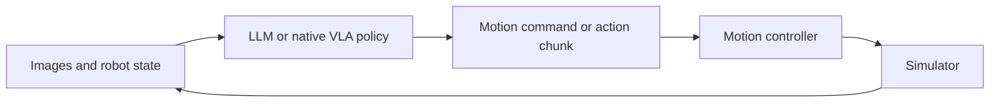

# LLM-agent for Robot Control


This repository provides a simple **agentic framework to use LLMs for robot control** and **Ditto Bench**, a benchmark designed to evaluate motion and control understanding with physical-challenging manipulation tasks. Use it to run LLM policies and native **pi05** and **MolmoAct2** baselines, define experiments through JSON configurations, and record and compare their behavior. Supported environments are **Ditto Bench**, **LIBERO**, and the official **MolmoAct2-ManiSkill** box task. 

The framework draws on [Inspect Robots](https://github.com/robocurve/inspect-robots), with a simplified control loop and detailed recording for research. Its LLM integration is primarily adapted for OpenAI-family models such as Astra through OpenAI Responses; compatibility with other models is not guaranteed.

## What is included


### Ditto Bench

Ditto Bench contains six tasks that require handling contact, geometric constraints, precise motion or tool use. Each task has `easy`, `medium`, `hard` and `xhard` variants, for 24 task–difficulty combinations. It is implemented in ManiSkill 3 / SAPIEN using MolmoAct2's DROID simulation setup with a Franka FR3 arm and Robotiq 2F-85 gripper.


| ID  | Task                   | Illustration                                                                                               | Goal                                                             | Core challenge                                                                          |
| --- | ---------------------- | ---------------------------------------------------------------------------------------------------------- | ---------------------------------------------------------------- | --------------------------------------------------------------------------------------- |
| 0   | Constrained extraction |                 | Pull the blue board completely out of the slot.                  | Align motion with a narrow channel while managing contact.                              |
| 1   | Odd-object grasping    |                      | Pick up the blue object and put it in the basket.                | Choose grasps across changes in shape and contact properties.                           |
| 2   | Precision insertion    |        | Insert the yellow object fully into the matching slot.           | Match shape and orientation under tight clearances.                                     |
| 3   | Standing stability     |  | Stand the object upright, gray base down, without robot contact. | Reorient and balance the object through controlled release.                             |
| 4   | Tool-assisted drawer   |              | Use the blue tool to open the drawer.                            | Engage the tool and transmit force through contact despite resistance and obstructions. |
| 5   | Ring release           |                 | Take the blue open ring off the fixed bridge.                    | Coordinate translation and rotation through a constrained opening.                      |


Evaluation records task success and a continuous progress score. See [task definitions](ditto-bench/docs/TASKS.md) for difficulty designs and scoring, and the [benchmark README](ditto-bench/README.md) for preview and direct Gym examples.

### Agentic framework

The framework connects observations, policy decisions and motion execution. An LLM receives camera images and public robot state, together with configurable interaction history and optional demonstrations, then issues a motion command. The controller executes the configured steps before the next observation. Native vision-language-action (VLA) policies use their own action adapters within the same evaluation and recording pipeline.




Recorded rollouts connect model requests and decisions to executed actions, observations and task outcomes. The framework includes DROID and LIBERO profiles for both native model families, with separate environments for simulator workers and model servers.

## Repository structure

```text
agentic-framework/       Policies, controllers, adapters, simulator workers and recording
ditto-bench/             Task physics, procedural geometry and success/progress scoring
examples/                Offline loop and focused agent, native VLA and preview configs
configs/experiments/     Configurations for the experiment conditions
scripts/                 Setup, evaluation and native model serving entry points
tools/                   Result summaries
docs/                    Installation, usage, architecture and task illustrations
credentials.env.example  Blank credential template
```

Environments, dependencies, weights, assets, caches and run outputs stay within the project under `envs/`, `third_party/`, `models/`, `data/`, `cache/`, `.config/` and `outputs/`. These local resources and your `credentials.env` are ignored by Git.

### Reading guide

Start with [Quick start](#quick-start) to run an example. For implementation details, [architecture](docs/ARCHITECTURE.md) explains the component boundaries; the entry points below show how configurations become policy decisions and motion.


| Area                     | Entry points                                                                                                                                                                                                                                                                                             |
| ------------------------ | -------------------------------------------------------------------------------------------------------------------------------------------------------------------------------------------------------------------------------------------------------------------------------------------------------- |
| Configuration and launch | [examples](examples), [experiment configs](configs/experiments) and [scripts/eval.py](scripts/eval.py).                                                                                                                                                                                                  |
| LLM control loop         | [harness/run.py](agentic-framework/src/agentic_framework/harness/run.py) assembles the run; [policy.py](agentic-framework/src/agentic_framework/harness/policy.py) makes decisions; [controller.py](agentic-framework/src/agentic_framework/harness/controller.py) executes motion.                      |
| Native VLA integration   | [Model profiles](agentic-framework/configs/models) select the checkpoint and defaults; [models/vla](agentic-framework/src/agentic_framework/models/vla) maps observations and actions; [native_controller.py](agentic-framework/src/agentic_framework/harness/native_controller.py) schedules execution. |
| Benchmark implementation | The [catalog](ditto-bench/src/ditto/catalog.py) lists tasks, [task implementations](ditto-bench/src/ditto/tasks) define physics and scoring, and [integration](ditto-bench/src/ditto/integration) connects them to the framework.                                                                        |


## Quick start


### Environment

Requires Linux and Python 3.11. Install [uv](https://docs.astral.sh/uv/) first, then run:

```bash
cd /path/to/project
bash scripts/setup.sh
envs/agentic-framework/bin/python -B examples/offline.py
```

The offline example runs two scripted decisions through the real policy and motion controller. It requires no GPU, simulator or API key and makes no model calls.

### API Key

For LLM runs, create a personal key in [OpenAI Platform](https://platform.openai.com/api-keys). Setup creates the ignored `credentials.env` from the blank [template](credentials.env.example) if it is absent. Fill `OPENAI_API_KEY`, keep `OPENAI_BASE_URL=https://api.openai.com/v1`, and run `chmod 600 credentials.env`. Preserve other entries if the file already exists. LLM configurations load this file through `llm.env_file`.

Preview and native VLA runs do not require an OpenAI key.

### Run a configuration

Complete the [simulator installation](docs/INSTALLATION.md) and, for native VLA runs, the model setup and weight downloads described there. Then activate the framework environment, inspect a configuration, and choose an example to run:

```bash
source envs/agentic-framework/bin/activate
python3 scripts/eval.py examples/agent.json --dry-run
CUDA_VISIBLE_DEVICES=0 python3 scripts/eval.py examples/preview.json
CUDA_VISIBLE_DEVICES=0 python3 scripts/eval.py examples/agent.json
CUDA_VISIBLE_DEVICES=0 python3 scripts/eval.py examples/molmoact2.json
```

`--dry-run` prints the resolved plan without starting models or simulators. Preview renders task scenes; `agent.json` runs the LLM controller; `molmoact2.json` runs the native MolmoAct2 policy. Select your GPU with `CUDA_VISIBLE_DEVICES`.

## Experiments and results

Copy a configuration from [examples](examples) or use a supplied condition under [configs/experiments](configs/experiments), then launch it with `python3 scripts/eval.py CONFIG.json`. Configure the model, reasoning effort, history, demonstrations, motion interface and H/K, tasks, seeds, step budgets, recording and output path in that JSON. Mode-specific runtime details use defaults unless overridden.

Runs save their resolved configuration, per-trial results and summaries under `outputs/` by default. Recorded runs also include trajectories, camera frames and video. Use [tools/summarize.py](tools/summarize.py) to aggregate completed runs:

```bash
python3 tools/summarize.py outputs/run-a outputs/run-b --output-dir outputs/summary
```

See [usage](docs/USAGE.md) for configuration fields, demonstration inputs, motion semantics and output formats.

## License

Original project code is licensed under the [MIT License](LICENSE). Bundled third-party code and separately downloaded resources retain their own licenses; see [third-party notices](THIRD_PARTY_NOTICES.md).