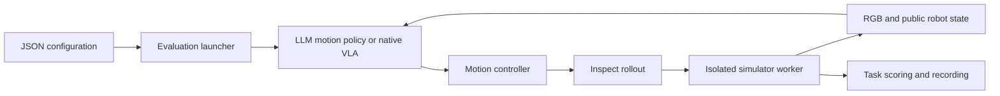

# Architecture

The two core directories are independent Python packages. The `ditto-bench` directory contains Ditto Bench, whose distribution, import package and suite identifier are `ditto`.

`agentic_framework.configuration` owns grouped arguments, defaults, model profiles, and motion limits. `harness` owns observation projection, demonstration validation, policy history, bounded repair, control scheduling, and trajectory recording. `models.llm` implements Responses and Codex transports and discovers optional installed backend extensions; `models.vla` implements native protocols and embodiment mappings. `environments` owns separate simulator workers and public observation contracts. `observability` records API/video evidence. The vendored Inspect library supplies the physical-step rollout and interface contracts.

The native adapters cover pi05 and MolmoAct2. The environment workers cover LIBERO and ManiSkill; Ditto Bench registers its tasks with the same ManiSkill worker as the official MolmoAct2 box task.

The portable launcher helper [scripts/workspace.py](../scripts/workspace.py) resolves project paths, model profiles, subprocess environments and native server commands. It anchors environments, upstream sources, model weights, data, caches, simulator configuration and outputs to the project root. Example/experiment JSON paths resolve from their own file directory. Model/resource profiles use project-root-relative paths. `AGENTIC_PROJECT_ROOT` can select a caller's project when using installed wheels; no machine-specific home layout is required.

`ditto.tasks` defines task physics and difficulty variants. `ditto.envs` registers tasks with ManiSkill. `ditto.assets` generates collision and visual geometry under the project's `data/generated/ditto-bench/v1`. `ditto.base` implements progress history and full snapshot/restore. `ditto.integration` supplies the task catalog and framework bindings.

The public policy never reads oracle object state. The recording channel can capture scene ground truth for offline evaluation while marking it `policy_visible=false`. Observation-only demonstrations use a separate projection that removes action outputs, object truth, outcomes, and backend metadata.

To add a native model, implement its adapter contract and register its identity, checkpoint, action cadence, source revision, and server resources in `agentic-framework/configs/models`. To add a task, implement its physics/reset and independent score, register it in the task catalog, and preserve deterministic seeded reset and snapshot support. Complete experiment conditions are ordinary JSON files under `configs/experiments`; their outputs stay under `outputs/`.
